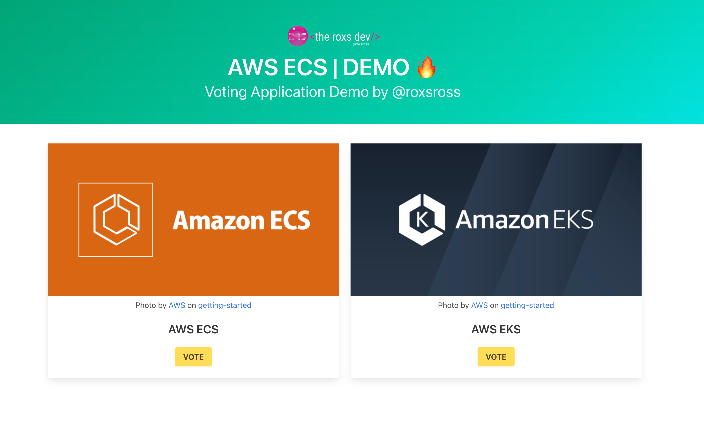
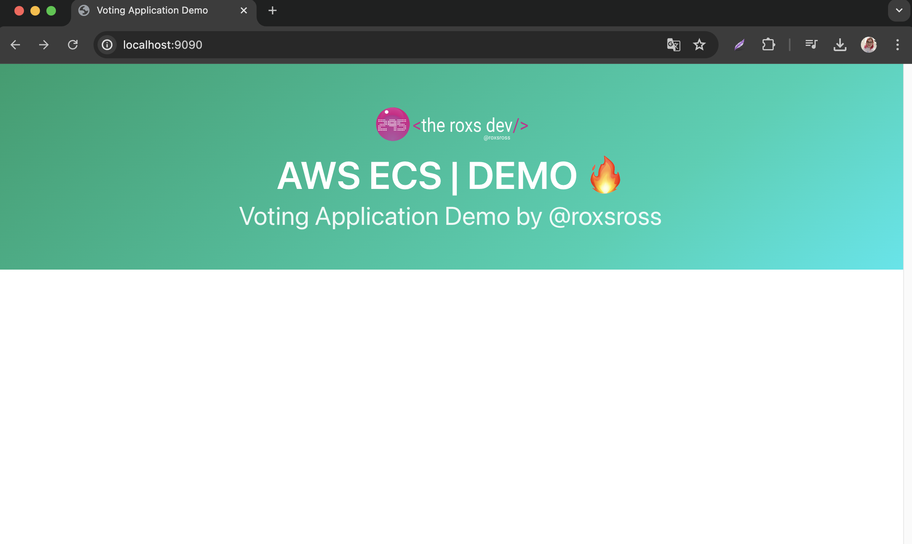
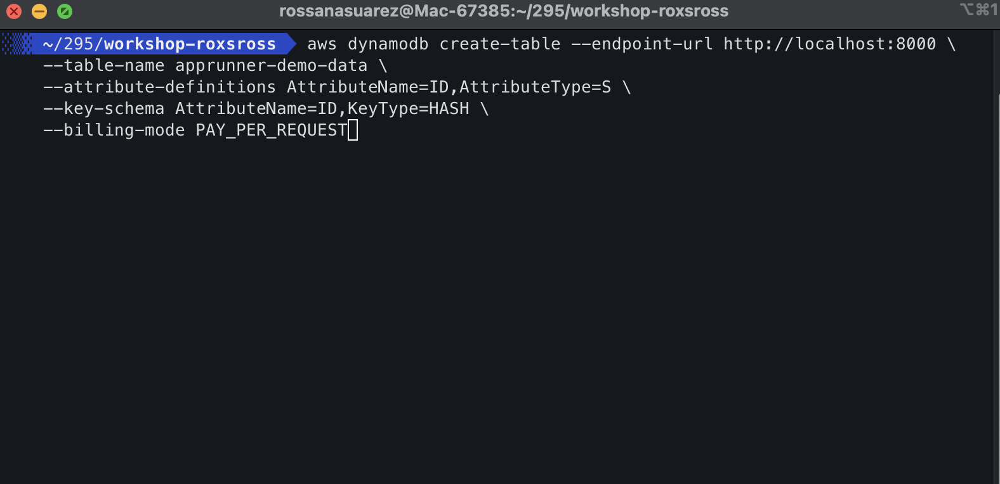
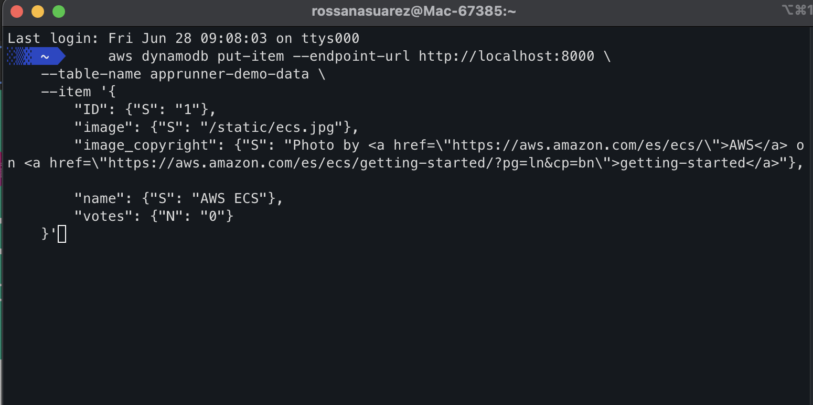
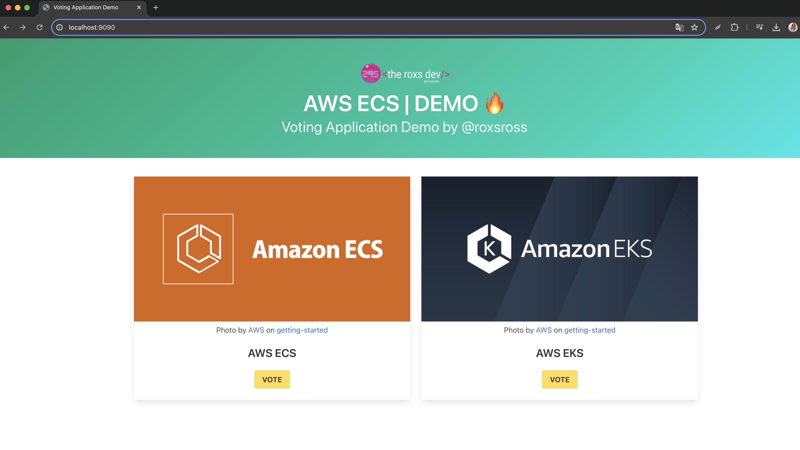
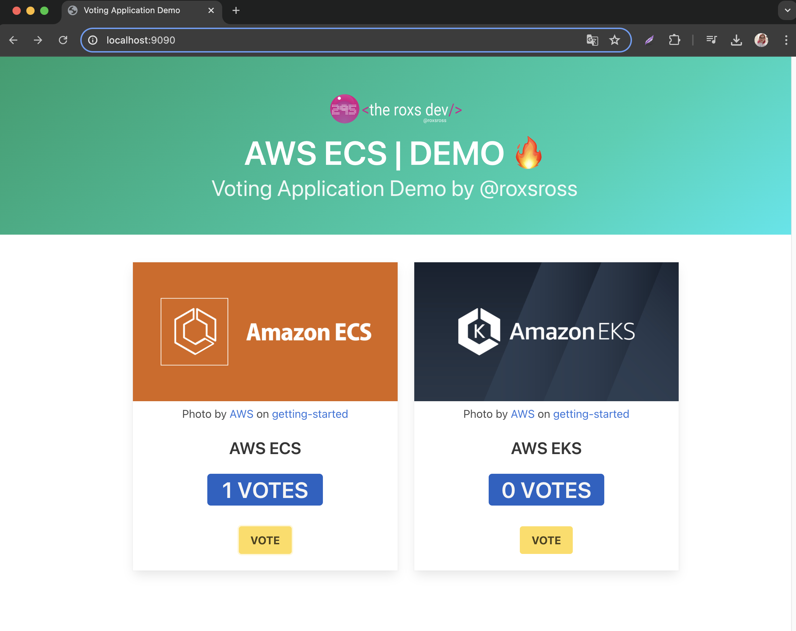

# Voting App 


---


🔥🔥🔥🔥

### by RoxsRoss

### Aplicación de Votación por RoxsRoss

Esta es una aplicación Flask diseñada para interactuar con una tabla DynamoDB localmente o en AWS, dependiendo del entorno configurado. La aplicación proporciona endpoints API para consultar opciones y registrar votos utilizando DynamoDB como backend.



## Información General sobre la Aplicación:

El archivo `app.py` sirve como núcleo de esta aplicación web construida con Flask.

## Configuración Inicial e Importaciones

- **Flask**: Utilizado para crear y gestionar la aplicación web.
- **boto3**: Cliente del SDK de AWS para Python, utilizado para la interacción con DynamoDB.
- **os**: Proporciona acceso a variables de entorno y otras funcionalidades del sistema operativo.
- **logging**: Facilita las funcionalidades de registro para seguir eventos durante la ejecución de la aplicación.
- **json**: Utilizado para trabajar con datos en formato JSON.
- **render_template**: Simplifica la renderización de plantillas HTML.
- **decimal**: Proporciona una clase Decimal para cálculos aritméticos precisos.
- **EndpointConnectionError**: Excepción específica de botocore para manejar errores de conexión.

## Configuración de la Aplicación

- **APP_AWS_REGION**: Define la región de AWS a utilizar. Por defecto, es 'us-east-1'.
- **APP_DDB_TABLE_NAME**: Especifica el nombre de la tabla DynamoDB. Por defecto, es 'app-demo-data'.
- **APP_PORT**: Define el puerto en el que se ejecutará la aplicación Flask. Por defecto, es 9090.
- **APP_MODE**: Indica el modo de ejecución de la aplicación, ya sea 'LOCAL' para DynamoDB local o 'PRODUCTION' para AWS.

## Configuración de Assets

En la carpeta `html/static`, puedes agregar nuevas imágenes que desees relacionar con los elementos que se muestran en la aplicación. Simplemente coloca las imágenes en esta carpeta y asegúrate de referenciarlas correctamente en la dynamodb

Recuerda que es importante mantener una estructura organizada en la carpeta `html/static` para facilitar la gestión de los activos y asegurarte de que las rutas de las imágenes sean correctas al referenciarlas en tu aplicación.

`"image": {"S": "/static/ecs.jpg"},`


## Configuración del Logger

Se configura un logger para registrar información relevante durante la ejecución de la aplicación, estableciendo su nivel en `logging.INFO`.

## Funcionalidades

- **Endpoints API:**
  - `/api/options`:
    - **GET**: Obtiene todas las opciones almacenadas en la tabla DynamoDB.
    - **POST**: Registra un voto para una opción específica.
  - Ambos endpoints manejan errores y proporcionan mensajes claros para problemas de conexión o solicitudes incorrectas.

- **Integración con DynamoDB:**
  - Utiliza `boto3` para la conexión con DynamoDB.
  - Configurable para usar DynamoDB local en desarrollo (`LOCAL`) o DynamoDB en AWS en producción (`PROD`).

## Requisitos Previos

- Python 3.x
- Pip (para instalar dependencias)
- Docker (opcional, para ejecutar DynamoDB localmente)

## Instalación y Uso

1. **Configuración:**
   
   - Configura las variables de entorno necesarias:
     - `APP_AWS_REGION`: Región de AWS para DynamoDB (por defecto: `us-east-1`).
     - `APP_DDB_TABLE_NAME`: Nombre de la tabla DynamoDB a utilizar (por defecto: `app-demo-data`).
     - `APP_PORT`: Puerto en el que se ejecutará la aplicación Flask (por defecto: `9090`).
     - `APP_MODE`: Modo de la aplicación (`LOCAL` para DynamoDB local, `PROD` para AWS).

2. **Ejecución:**

   ```bash
   python app.py
   ```

   La aplicación estará disponible en `http://localhost:9090/`.

3. **Configuración de DynamoDB Local:**
    - Configura un contenedor con DynamoDB Local. Consulta la [documentación oficial de AWS](https://docs.aws.amazon.com/amazondynamodb/latest/developerguide/DynamoDBLocal.DownloadingAndRunning.html).

    ```yaml
    version: '3.8'
    services:
      dynamodb-local:
        command: "-jar DynamoDBLocal.jar -sharedDb -dbPath ./data"
        image: "amazon/dynamodb-local:latest"
        container_name: dynamodb-local
        ports:
          - "8000:8000"
        volumes:
          - "./docker/dynamodb:/home/dynamodblocal/data"
        working_dir: /home/dynamodblocal
    ```

    - Verifica la disponibilidad:

    ```bash
    curl http://localhost:8000
    ```

    - Lista todas las tablas:

    ```bash
    aws dynamodb list-tables --endpoint-url http://localhost:8000 --region us-east-1 
    ```

    - Crea una tabla | ejemplo: `apprunner-demo-data`

    ```bash
    aws dynamodb create-table --endpoint-url http://localhost:8000 \
    --table-name apprunner-demo-data \
    --attribute-definitions AttributeName=ID,AttributeType=S \
    --key-schema AttributeName=ID,KeyType=HASH \
    --billing-mode PAY_PER_REQUEST
    ```

    - Inserta elementos en la tabla

        ### Insertar items en la tabla | Item1

    ```bash
    aws dynamodb put-item --endpoint-url http://localhost:8000 \
    --table-name apprunner-demo-data \
    --item '{
        "ID": {"S": "1"},
        "image": {"S": "/static/ecs.jpg"},
        "image_copyright": {"S": "Photo by <a href=\"https://aws.amazon.com/es/ecs/\">AWS</a> on <a href=\"https://aws.amazon.com/es/ecs/getting-started/?pg=ln&cp=bn\">getting-started</a>"},
        "name": {"S": "AWS ECS"},
        "votes": {"N": "0"}
    }'
    ```
    ### Insertar items en la tabla | Item2

    ````
    aws dynamodb put-item --endpoint-url http://localhost:8000 \
    --table-name apprunner-demo-data \
    --item '{
        "ID": {"S": "2"},
        "image": {"S": "/static/eks.jpg"},
        "image_copyright": {"S": "Photo by <a href=\"https://aws.amazon.com/es/eks/\">AWS</a> on <a href=\"https://aws.amazon.com/es/eks/features/\">getting-started</a>"},
        "name": {"S": "AWS EKS"},
        "votes": {"N": "0"}
    }'
    ````

4. **Uso de docker-compose para pruebas locales:**
    - Ejemplo de archivo [docker-compose](./docker-compose.yml).
    - Para ejecutar: `docker-compose up -d --build`.

## Info

- Asegúrate de tener DynamoDB Local ejecutándose si estás en modo `LOCAL`. Docker puede ser utilizado para la ejecución de DynamoDB local.
- La aplicación maneja errores de conexión con DynamoDB y proporciona mensajes adecuados al usuario.

# Uso de AWS ECS

Amazon ECS es un servicio de orquestación de contenedores altamente escalable y completamente administrado por AWS. Permite ejecutar, escalar y administrar contenedores Docker en la nube con facilidad.

## Arquitectura Utilizando Amazon Elastic Container Service (ECS)


## Despliegue en Amazon ECS

### Configuración

Para desplegar esta aplicación en Amazon ECS, sigue estos pasos:

1. **Dockerizar la Aplicación:**
   
   Asegúrate de tener un `Dockerfile` en la raíz de tu proyecto que describa cómo construir la imagen Docker de tu aplicación Flask.

   ```dockerfile
   FROM python:3.10-alpine

   WORKDIR /app

   COPY requirements.txt requirements.txt
   RUN pip install --no-cache-dir -r requirements.txt

   COPY . .

   CMD ["python", "app.py"]
   ```

2. **Construir y Subir la Imagen Docker:**
   
   Usa Docker para construir tu imagen y súbela a un registro de contenedores compatible (como Amazon ECR o Docker Hub).

   ```bash
   docker build -t mi-aplicacion-flask .
   docker tag mi-aplicacion-flask:latest <tu-registro>/mi-aplicacion-flask:latest
   docker push <tu-registro>/mi-aplicacion-flask:latest
   ```

3. **Configurar Amazon ECS:**
   
   - Crea un clúster ECS y un grupo de servicios.
   - Define una tarea ECS utilizando la imagen Docker que subiste.
   - Configura el balanceador de carga y las reglas de escalado automático según sea necesario.

4. **Desplegar la Aplicación:**
   
   Usa la consola de ECS o la CLI de AWS para desplegar tu tarea en el clúster configurado.


### Funcionamiento en Imágenes 

1. **Acceder al Navegador:**
  

2. **Crear tabla:**
  

3. **Insertar Items:**
  

4. **Validar Items en Navegador:**
  

5. **Efectuar Votos:**
  


🔥🔥🔥🔥

 


### ✉️  &nbsp;Contactos 

Me puedes encontrar en:

[ ](https://blog.295devops.com)
[](https://dev.to/roxsross)

[](https://www.linkedin.com/in/roxsross/)
[](https://www.instagram.com/roxsross/)
[](https://www.youtube.com/channel/UCa-FcaB75ZtqWd1YCWW6INQ)


<samp>
"Para entender algo no debes entenderlo sino serlo"
<samp>
  </div>
  
   [](https://www.buymeacoffee.com/roxsross)
